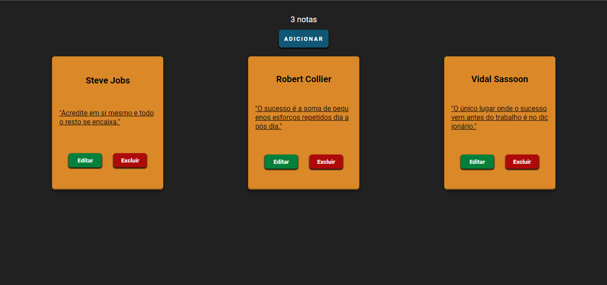

# Notes App

Uma aplicação simples para gerenciar anotações de forma fácil e intuitiva. Permitindo que usuários possam criar, visualizar, editar e excluir anotações de forma fácil e rápida.

## Imagem do Projeto 🖼

## Tecnologias utilizadas 🛠

- React
- JSX
- CSS

## Funcionalidades 📃

- Adicionar anotação: Os usuários podem criar novas anotações, fornecendo um título e conteúdo.
- Visualizar anotações: Todas as anotações são exibidas em uma lista, onde os usuários podem ver o título e conteúdo de cada uma.
- Editar anotação: Ao clicar no botão de edição em uma anotação, os usuários podem alterar o título e conteúdo da anotação selecionada.
- Excluir anotação: Os usuários podem remover uma anotação da lista ao clicar no botão de exclusão correspondente.

## Como usar 📋

1. Clone o repositório: git clone <https://github.com/josephmatheus/react-notes-app.git>
2. Navegue até o diretório do projeto: `cd notes-app`
3. Instale as dependências: `npm install`
4. Inicie a aplicação: `npm start`
5. Acesse a aplicação no seu navegador: <http://localhost:3000>

## Estrutura do projeto 🧬

- src
  - components: Contém os componentes React utilizados na aplicação.
    - NoteForm: Formulário para adicionar novas anotações.
    - NoteList: Lista de anotações existentes.
    - NoteItem: Item individual da lista de anotações.
    - NoteEditForm: Formulário para editar uma anotação existente.
  - App.jsx: Componente raiz da aplicação.
  - index.jsx: Ponto de entrada da aplicação.

## Contribuição 🤝

**Contribuições são bem-vindas!**

Sinta-se à vontade para abrir uma _issue_ ou enviar um _pull request_.

Algumas Sugestões (que também são o que penso implementar):

- Implementar pesquisa de anotações por título ou conteúdo.
- Adicionar filtros ou categorias para organizar as anotações em diferentes grupos.
- Adicionar uma funcionalidade de marcação para destacar anotações importantes ou concluídas.
- Explorar outras melhorias e recursos que você achar relevantes para o Notes App.

## Licença 📝

Este projeto está licenciado sob a [**MIT License**](./LICENSE.md).
